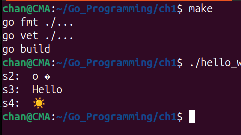

# Strings & Runes & Types

- Go uses a sequence of bytes to represent a string.
- Go library functions (the `for-range` loop) assume that a string is composed of a sequence of UTF-8-encoded code points.
- Unless we use hexadecimal escapes in a string literal, the string literals are written in UTF-8. 
- We can extract a single value from a string by using an **index expression** just like we can from an array or a slice.

### Example #1

```go
package main

import (
	"fmt"
)

func main() {
	var s string = "Hello there"
	var b byte = s[6]
	var s2 string = s[4:7]
	s3 := s[:5]
	s4 := s[6:]

	fmt.Println("b: ", b)
	fmt.Println("s2: ", s2)
	fmt.Println("s3: ", s3)
	fmt.Println("s4: ", s4)
}
```

```sh
chan@CMA:~/Go_Programming/ch1$ make
go fmt ./...
go vet ./...
go build 
chan@CMA:~/Go_Programming/ch1$ ./hello_world
b:  116
s2:  o t
s3:  Hello
s4:  there
```

### Example #2

```go
package main

import (
	"fmt"
)

func main() {
	var s string = "Hello ☀️"
	s2 := s[4:7]
	s3 := s[:5]
	s4 := s[6:]
	fmt.Println("s2: ", s2)
	fmt.Println("s3: ", s3)
	fmt.Println("s4: ", s4)
}
```



- The `s2` is not set to "o ☀️". Instead we get "o �" because we copied only the first byte of the sun emoji's code point which is not a valid code point on its own.
