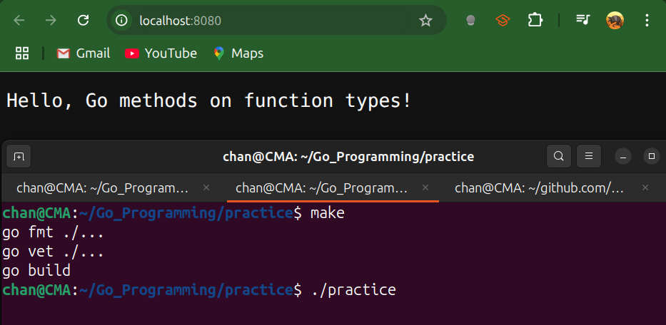

# Function Types Are a Bridge to Interfaces

- In Go we can attach methods to **any** user-defined type, even a function type, 
  - so that the function value itself implements an interface.
- The most common usage is for HTTP handlers.
- An HTTP handler processes an HTTP server request.
- It's defined by an interface.

```go
type Handler interface{
    ServeHTTP(http.ResponseWriter, *http.Request)
}
```


## Code Example

- In the following Example:
  - We declare `MyHandlerFunc` as a function type taking `(ResponseWriter, *Request)`.
  - We define a method `ServeHTTP` on it. Because `ServeHTTP(http.ResponseWriter, *http.Request)` is exactly the single method in the `http.Handler` interface, any `MyHandlerFunc` value now implements `http.Handler`.
  - WE write `HelloHandler` as a plain function.
  - We convert it to `MyHandlerFunc` and pass it wherever an `http.Handler` is expected.

```go
package main

import (
	"fmt"
	"net/http"
)

// 1 define a function type matching the signature we want
type MyHandlerFunc func(w http.ResponseWriter, r *http.Request)

// 2 Attach the ServeHTTP method so MyHandlerFunc satisfied http.Handler
func (h MyHandlerFunc) ServeHTTP(w http.ResponseWriter, r *http.Request) {
	// simply call the underlying function
	h(w, r)
}

// 3 Write a plain function with matching signature
func HelloHandler(w http.ResponseWriter, r *http.Request) {
	fmt.Fprintln(w, "Hello, Go methods on function types!")
}

func main() {
	// 4 Convert the function to MyHandlerFunc, assign to http.Handler
	var handler http.Handler = MyHandlerFunc(HelloHandler)

	// 5 Use it just like any other Handler
	http.ListenAndServe(":8080", handler)
}
```



---

