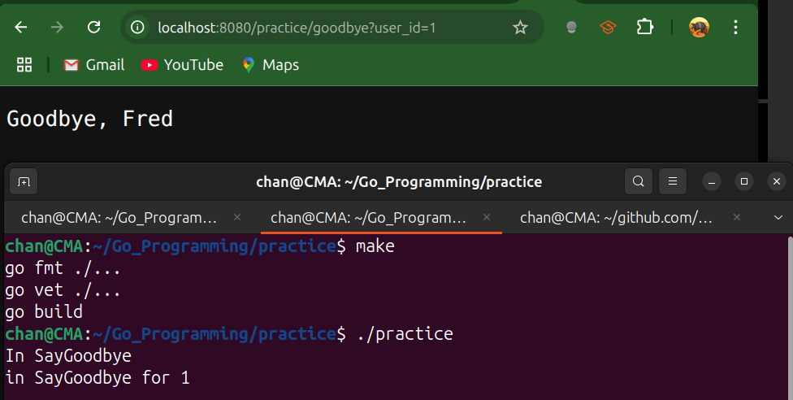
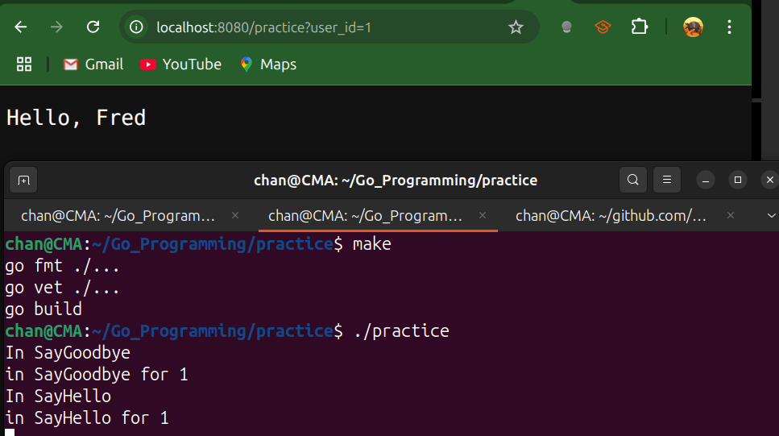

# Implicit Interfaces Make Dependency Injection Easier

- We should structure our programs in ways that make them easier to modify.
  - Decoupling code, so that changes to different parts of a program have no effect on one another.
- Dependency Injection is the concept that our code should explicitly specify the functionality it needs to perform its task.
- By Definition, Dependency Injection is a design pattern where an object or function receives other objects or functions that it depends on (its "dependencies") from an external source, rather than creating them internally.
- Go's implicit interfaces make dependency injection an excellent way to decouple our code.


```
Without DI: A chef decides they need a knife. They go to the back room, forge a knife from raw metal, sharpen it, and then use it. If they need a different kind of knife, they have to repeat the whole process. The chef is tightly coupled to the process of knife creation.
With DI: The chef needs a knife. The kitchen manager (an external source) provides (injects) a suitable knife. If a different knife is needed, the manager provides that one. The chef is decoupled from knife creation and can focus on cooking.
```


---

## Code Example

- This example shows how to use implicit interfaces to compose applications via dependency injection.

```go
package main

import (
	"errors"
	"fmt"
	"net/http"
)

// a utility function that satisfied the Logger interface
func LogOutput(message string) {
	fmt.Println(message)
}

// a data store that holds a map of user IDs to names.
type SimpleDataStore struct {
	userData map[string]string
}

// returns the username for a given userID and a boolean indicating presence.
func (sds SimpleDataStore) UserNameForID(userID string) (string, bool) {
	name, ok := sds.userData[userID]
	return name, ok
}

// a factory function to create an instance of SimpleDataStore
func NewSimpleDataStore() SimpleDataStore {
	return SimpleDataStore{
		userData: map[string]string{
			"1": "Fred",
			"2": "Mary",
			"3": "Pat",
		},
	}
}

// next up is some business logic that looks up a user and says hello or goodbye
// logic needs data to work with so it requires a data store
// we want our business logic to log when it is provoked, so it depends on a logger
// but, we don't want to force it to depend on LogOutput or SimpleDataStore because we might want to use a different logger or data store later.
// DataStore here defines the abstraction for any data source providing user names by ID.
type DataStore interface {
	UserNameForID(userID string) (string, bool)
}

// Logger defines the abstraction for logging messages
type Logger interface {
	Log(message string)
}

// to make our LogOutPut function meet this interface, we will define a function type with a method on it
// LoggerAdapter is a function type that turns any function signature matching func(string) into a Logger by implementing Log.
type LoggerAdapter func(message string)

// Log calls the underlying function, allowing LoggerAdapter to satisfy Logger.
func (lg LoggerAdapter) Log(message string) {
	lg(message)
}

// LoggerAdapter and SimpleDataStore happen to meet the interfaces needed by our business logic, but neither type has any idea that it does.
// SimpleLogic encapsulates business logic and depends on a Logger and DataStore via interfaces.
type SimpleLogic struct {
	l  Logger
	ds DataStore
}

func (sl SimpleLogic) SayHello(userID string) (string, error) {
	sl.l.Log("in SayHello for " + userID)
	name, ok := sl.ds.UserNameForID(userID)
	if !ok {
		return "", errors.New("unknown user")
	}
	return "Hello, " + name, nil
}

func (sl SimpleLogic) SayGoodbye(userID string) (string, error) {
	sl.l.Log("in SayGoodbye for " + userID)
	name, ok := sl.ds.UserNameForID(userID)
	if !ok {
		return "", errors.New("unknown user")
	}
	return "Goodbye, " + name, nil
}

// NewSimpleLogic is a constructor that injects Logger and DataStore into SimpleLogic
func NewSimpleLogic(l Logger, ds DataStore) SimpleLogic {
	return SimpleLogic{
		l:  l,
		ds: ds,
	}
}

// Logic defines the interface for business operations provided by SimpleLogic or any other implementation
type Logic interface {
	SayHello(userID string) (string, error)
	SayGoodbye(userID string) (string, error)
}

// Controller handles HTTP requests and delegates to the business logic and logging.
type Controller struct {
	l     Logger
	logic Logic
}

// SayHello handles HTTP /practice?user_id=... and writes a greeting or error status.
func (c Controller) SayHello(w http.ResponseWriter, r *http.Request) {
	c.l.Log("In SayHello")
	userID := r.URL.Query().Get("user_id")
    
    // call the SayHello function method of logic (Logic interface)
	message, err := c.logic.SayHello(userID)
	if err != nil {
		w.WriteHeader(http.StatusBadRequest)
		w.Write([]byte(err.Error()))
		return
	}
	w.Write([]byte(message))
}

// SayGoodbye handles HTTP /practice/goodbye?user_id=... and writes a farewell or error status.
func (c Controller) SayGoodbye(w http.ResponseWriter, r *http.Request) {
	c.l.Log("In SayGoodbye")
	userID := r.URL.Query().Get("user_id")
	msg, err := c.logic.SayGoodbye(userID)
	if err != nil {
		w.WriteHeader(http.StatusBadRequest)
		return
	}
	w.Write([]byte(msg))

}

// factory function for Controller
// NewController constructs a Controller by injecting Logger and Logic implementations.
func NewController(l Logger, logic Logic) Controller {
	return Controller{
		l:     l,
		logic: logic,
	}
}

// the main function is the only part of the code that knows what all the concrete types actually are
// externalizing the dependencies via dependency injection means that we limit the changes that are needed to evolve our code over time
func main() {
	l := LoggerAdapter(LogOutput)
	ds := NewSimpleDataStore()
	logic := NewSimpleLogic(l, ds)
	c := NewController(l, logic)
	http.HandleFunc("/practice", c.SayHello)
	http.HandleFunc("/practice/goodbye", c.SayGoodbye)
	http.ListenAndServe(":8080", nil)
}

```

- The line `http.HandleFunc("/practice", c.SayHello)` demonstrates two points,
  - First we are treating the `SayHello` method as a function.
  - Second, the `http.HandleFunc` function takes in a function and converts it to an `http.HandlerFunc` function type, which declares a method to meet the `http.Handler` interface, which is the type used to present a request handler in Go.
- Basically, we took a method from one type and converted it into another type with its own method.





