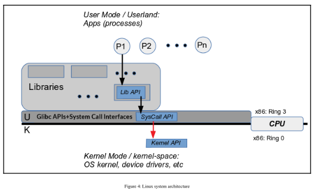
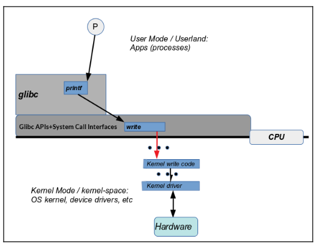

# Linux architecture

- The Linux system architecture is a layered one.

**Linux - Simplified layered architecture**

| Application                                |
| ------------------------------------------ |
| Libraries                                  |
| glibc/ System Call Interface (SCI)         |
| Operating System (OS) kernel, drivers, etc |
| Hardware Layer                             |

- Layers help because each layer need only be concerned with the layer directly above and below it. This leads to many advantages:
  - Clean design, reduces complexity
  - Standardization, interoperability
  - Ability to swap layers in and out of the stack
  - Ability to easily introduce new layers as required.

- In the preceding diagram, P1, P2, ..., Pn are nothing but userland processes (Process 1, Process 2 etc), or in other words running applications.

## Libraries

- Libraries are archives (collections) of code. Using libraries helps tremendously with code modularity, standardization, preventing the reinvent-the-wheel syndrome.
- For example, the code `printf` is part of the standard C library on Linux due to its GNU origins, this library is commonly called **GNU libc (glibc)**.
- Glibc is a critical and required component on a Linux box.
- It not only contains the usual standard C library routines (APIs), it is, in fact, the programming interface to the operating system via its lower layer, the system calls.

## System calls

- System calls are actually kernel functionality that can be invoked from userspace via glibc stub routines. They **connect userspace to kernel-space**.
- If a user program wants to request something of the kernel (read from a file, write to the network, change a file's permissions), it does so by issuing a system call.
- System calls are the only legal entry point to the kernel. No other way for a user-space process to invoke the kernel.
- The Linux kernel internally has thousands of APIs (or functions).
- Of these, only a small fraction are made visible or available that is exposed to userspace. These exposed kernel APIs are **system calls**.
- Modern Linux glibc has around 300 system calls.
- System calls are very different from all other (typically library) APIs. 
- As they ultimately invoke kernel (OS) code, they have the ability to cross the user-kernel boundary.
  - They have the ability to switch from normal unprivileged User mode to completely privileged Supervisor or kernel mode.
  - **System calls essentially work** by invoking special machine instructions that have the built-in ability to switch the processor mode from User to Supervisor.

### System calls from the viewpoint of the application developer

- A key point regarding system calls is that system calls appear to be regular functions (APIs) that can be invoked by the developer; the design is deliberate.
- The system call APIs that one invokes such as `open()`, `read()`, `chmod()`, `dup()`, and `write()` - are merely stubs.
  - They are a neat mechanism to get at the actual code that is in the kernel (getting there involves populating a register the accumulator on x86 - with the system call number, and passing parameters via other general-purpose registers) to execute that kernel code  path, and return back to user mode when done.

## Linux

- On the Linux OS, applications run as independent entities called **processes**. 
  - A process may be single-threaded (original Unix) or multithreaded. 
  - A process is an instance of a program in execution.
- When a user-space process issues a library call, the library API, in turn, may or may not issue a system call.
  - For example, issuing the `atoi(3)` API does not cause glibc to issue a system call as it does not require kernel support to implement the conversion of a string into an integer.
- On the other hand, `printf(3)` API does not write to the monitor. It only has the intelligence to format a string as specified.
  - Once done, `printf` actually invokes the `write(2)` API - a system call.
  - The write system call does have the ability to write the buffer content to the monitor device, seen by write as stdout.
  - The kernel code of write switches to the correct driver code; the device driver is the only component that can directly work with peripheral hardware.
  - It performs the actual write to the monitor, and return values propagate all the way back to the application.

In the following diagram, P is the `hello, world` process at runtime:

It's easy to assume that it works this way:

1. The `hello, world` app (process) issues the `printf(3)` library call.
2. `printf` issues the `write(2)` system call.
3. We switch from User to Supervisor (kernel) Mode.
4. The kernel takes over - it writes `hello, world` onto the monitor.
5. Switch back to non-privileged User Mode.