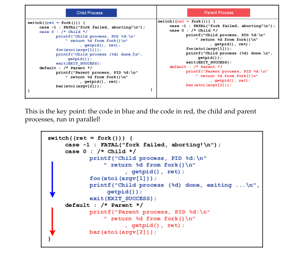

# Using the fork system call

```c
pid_t fork(void);
```


```c
#define _GNU_SOURCE
#include <stdlib.h>
#include <stdio.h>
#include <assert.h>
#include <string.h>
#include <strings.h>
#include <sys/types.h>
#include <sys/time.h>
#include <unistd.h>
#include <sys/resource.h>
#include <sys/mman.h>
#include <alloca.h>
#include <malloc.h>
#include <sys/capability.h>
#include <errno.h>
#include "hello.h"

int main()
{
    if (fork() == -1)
    {
        perror("fork");
        exit(1);
    }
    printf("Hello, fork.\n");

    return 0;
}
```

```sh
chan@CMA:~/C_Programming/test$ ./final
Hello, fork.
Hello, fork.
```

- The `printf` have been executed twice. 
- Once by the parent process, and once by the new child process.
- Why? The job of the fork is to create a copy of the parent, the child. 
- Once done, both processes must now return to user space from kernel mode. Thus, fork is called once but returns twice; once in the parent and once in the child process context.

---

## Fork rule #1

**Fork rule #1**: After a successful fork, execution in both the parent and child process continues at the instruction following the fork.


### Why does it happen this way?

- The job of fork is to make a identical copy of the parent in the child. 
  - This includes the hardware context, which of course includes the **Instruction Pointer (IP)** register (sometimes called the **Program Counter (PC)**) iteself.
- Hence, the child process too will execute the user mode code at the same location as the parent.
- As the fork is successful, control will not go the error handling code.
- Instead it will go to the `printf`.
- **The key point is this will happen in both the (original) parent and the (new) child process.**

```c
#define _GNU_SOURCE
#include <stdlib.h>
#include <stdio.h>
#include <assert.h>
#include <string.h>
#include <strings.h>
#include <sys/types.h>
#include <sys/time.h>
#include <unistd.h>
#include <sys/resource.h>
#include <sys/mman.h>
#include <alloca.h>
#include <malloc.h>
#include <sys/capability.h>
#include <errno.h>
#include "hello.h"

int main()
{
    if (fork() == -1)
    {
        perror("fork");
        exit(1);
    }
    printf("PID: %d: Hello, fork.\n", getpid());

    return 0;
}
```

```sh
chan@CMA:~/C_Programming/test$ ./final
PID: 25745: Hello, fork.
PID: 25746: Hello, fork.
```

- The PID 25745 is the parent process and the other of course is the child.
- After this, the program exits and thus both processes die.

---

## Fork rule #2 - the return

**Fork rule #2**: To determine whether you are running in the parent or child process, use the fork return value. It's always 0 in the child and the PID of the child in the parent.

### Code

```c
#define _GNU_SOURCE
#include <stdlib.h>
#include <stdio.h>
#include <assert.h>
#include <string.h>
#include <strings.h>
#include <sys/types.h>
#include <sys/time.h>
#include <unistd.h>
#include <sys/resource.h>
#include <sys/mman.h>
#include <alloca.h>
#include <malloc.h>
#include <sys/capability.h>
#include <errno.h>
#include "hello.h"

static void foo(unsigned int sec)
{
    printf(" %s:%s :: will take a nap for %us ...\n", __FILE__, __FUNCTION__, sec);
    sleep(sec);
}

static void bar(unsigned int sec)
{
    printf(" %s:%s :: will take a nap for %us ...\n", __FILE__, __FUNCTION__, sec);
    sleep(sec);
}

int main(int argc, char *argv[])
{
    pid_t ret;

    if (argc != 3)
    {
        fprintf(stderr, "Usage: %s {child-alive-sec} {parent-alive-sec}\n", argv[0]);
        exit(EXIT_FAILURE);
    }

    switch (ret = fork())
    {
    case -1:
        perror("fork failed, aborting!\n");
        exit(EXIT_FAILURE);
    case 0: // child
        printf("Child process, PID %d:\n"
               " return %d from fork()\n",
               getpid(), ret);
        foo(atoi(argv[1]));
        printf("Child process (%d) done, exiting...\n", getpid());
        exit(EXIT_SUCCESS);
    default: // parent
        printf("Parent process, PID %d:\n"
               " return %d from fork()\n",
               getpid(), ret);
        bar(atoi(argv[2]));
    }
    printf("Parent process (%d) done, exiting...\n", getpid());
    return 0;
}
```

- Rule #1 - execution in both the parent and child process continues at the instruction following the fork. 
  - Here, the instruction following the fork is not the switch, but rather the initialization of the variable `ret`. 
  - It will guarantee that `ret` is initialized twice: once in the parent and once in the child, but to different values.

- As we learned in rule 2, fork returns 0 in the child and the PID of the child in the parent. We use this knowledge to distinguish between the child and parent in the code.
- When the child process ID is done, we do not have it call `break`. Instead we have it exit.
- The reason is for clarity. Have the child do whatever it requires within its business logic (`foo()`), and then simply have it go away.
- If we did use a break, we would require another `if` condition after the `switch` statement. This would be ugly and harder to understand.
- The parent process falls through the switch-case, it just emits a print and exits.

```sh
chan@CMA:~/C_Programming/test$ ./final
Usage: ./final {child-alive-sec} {parent-alive-sec}
chan@CMA:~/C_Programming/test$ ./final 3 7
Parent process, PID 27469:
 return 27470 from fork()
 main.c:bar :: will take a nap for 7s ...
Child process, PID 27470:
 return 0 from fork()
 main.c:foo :: will take a nap for 3s ...
Child process (27470) done, exiting...
Parent process (27469) done, exiting...
```

---

## Fork Rule #3

**Fork Rule #3**: After a successful fork, both the parent and child process execute code in parallel.


- At first glance, this rule looks pretty much the same as the first rule.
- But what's being stressed here is parallelism. The parent's and child's execution paths run in parallel with each other.



- In the second diagram, the blue and red timeline arrows are used to depict this parallelism.

#### Atomic execution?

- *Atomic execution*: A piece of code is considered to be atomic if and only if it always runs to completion without interruption. 
- According to the diagram, one can be misled to believing that once the process starts executing its code, it continues undisturbed until it finished.
- Not necessarily, in reality, the process will often get context switched out of and back into the CPU as they run.
- Atomicity, especially in user-space, is not guaranteed. Often the process or thread execution is interrupted or preempted (sources of interruption/preemption include hardware interrupts, faults, or exceptions and scheduler context switching).
- Keeping a code section atomic within the kernel can be arranged though.

---

## Fork rule #4 - data

**Fork Rule #4**: Data is copied across the fork, not shared.

- We understand that when a parent process forks, the child is created; it is a copy of the parent.
- This will include the VAS, and thus, the data and stack segments.
- As the child has a copy of the parent's variables, all goes well. They change independently of one another. 

### Code

```c
#define _GNU_SOURCE
#include <stdlib.h>
#include <stdio.h>
#include <assert.h>
#include <string.h>
#include <strings.h>
#include <sys/types.h>
#include <sys/time.h>
#include <unistd.h>
#include <sys/resource.h>
#include <sys/mman.h>
#include <alloca.h>
#include <malloc.h>
#include <sys/capability.h>
#include <sys/wait.h>
#include <errno.h>
#include "hello.h"

int main(int argc, char *argv[])
{
    int x = 10;

    printf("Parent before fork: x = %d\n", x);

    pid_t pid = fork();

    if (pid < 0)
    {
        perror("fork failed");
        return 1;
    }
    else if (pid == 0)
    {
        // child process: modify x
        x = 20;
        printf("Child: x = %d (after modification)\n", x);

        // child process exits here
        return 0;
    }
    else
    {
        // parent process :wait for the child to finish
        wait(NULL);
        // parent's copy of x remains unchanged
        printf("Parent after fork: x = %d\n", x);
    }

    return 0;
}
```

```sh
chan@CMA:~/C_Programming/test$ ./final
Parent before fork: x = 10
Child: x = 20 (after modification)
Parent after fork: x = 10
```

---

## Fork rule #5 - racing

**Fork rule #5**: After the fork, the order of execution between the parent and child process is indeterminate.

- The parent might run first the next 50,000 times we try it out, but on the 50,001st trial run, the child process may run first. It is **unpredictable**.
- It's often called a **race condition**. We cannot predict with certainty who will be the winner.
- Often in software design, we do have to actually care whether the parent or child process wins the race.
  - In such cases, we need a way to guarantee the winner. This is called synchronization.

---


## The process and open files

- A Unix/Linux process, upon startup, will by default be assigned three open files, `stdin`, `stdout`, and `stderr`
- Real applications will certainly open other files as they perform their tasks.
- If a Linux application opens a file using the `fopen(3)` library API, it will ultimately boil down to the `open(2)` system call, which returns a handle to the open file, called a **file descriptor**.
- The kernel stores every process's open files within a data structure. (In Unix, it's called **Open File Descriptor Table (OFDT)**.
- Open files are indeed inherited by the child.

---

## Fork rule #6 - open files

**Fork rule #6**: Open files are (loosely) shared across the fork.

- When either the parent or child process closes the open file, its access to the open file is closed. The file is still open in the other process. 
- This is what is meant by the phrase "loosely shared".


- The systems programmer must understand that if the parent process has opened a file or files,  naively working on the file simultaneously will likely cause bugs.
- Although the processes are distinct, the object they work upon, the open file, and its inode, is one distinct object and thus shared.
- In fact, the file's **seek position** is an attribute of the inode. Blindly re-positioning the seek pointer in parent and child without synchronization will pretty much guarantee problems.


There are broadly two choices to keep things running smoothly:

- Have one of the process close the file
  - This keeps things simple but is of limited use in real-world applications. They would usually require that the file remains open.
- Synchronize access to the open file.
  - We can synchronize file I/O between processes:
    - Via the SysV IPC or POSIX semaphore
      - This one works, but crudely. It is not considered the right way.
    - Via file locking
      - This one is the preferred one.


### Code

- Below is an example C program that demonstrates how open file descriptors are shared (loosely) between a parent and child process created via fork. 
- In this example, the parent opens a file and writes an initial message, then forks. 
- Both the child and the parent use the same file descriptor to write additional messages. Because they share the file offset, the writes occur sequentially based on the current offset.

```c
#define _GNU_SOURCE
#include <stdlib.h>
#include <stdio.h>
#include <assert.h>
#include <string.h>
#include <strings.h>
#include <sys/types.h>
#include <sys/time.h>
#include <unistd.h>
#include <sys/resource.h>
#include <sys/mman.h>
#include <alloca.h>
#include <malloc.h>
#include <fcntl.h>
#include <sys/capability.h>
#include <sys/wait.h>
#include <errno.h>
#include "hello.h"

int main(int argc, char *argv[])
{
    // Open or create the file for read/write, and truncate any existing content.
    int fd = open("shared.txt", O_RDWR | O_CREAT | O_TRUNC, 0644);
    if (fd == -1)
    {
        perror("open");
        exit(EXIT_FAILURE);
    }

    // Write an initial message
    const char *initial = "Start: ";
    if (write(fd, initial, strlen(initial)) == -1)
    {
        perror("write initial");
        exit(EXIT_FAILURE);
    }

    // Fork the process
    pid_t pid = fork();
    if (pid < 0)
    {
        perror("fork");
        exit(EXIT_FAILURE);
    }
    else if (pid == 0)
    {
        // child process: write its message
        const char *childMsg = "child ";
        if (write(fd, childMsg, strlen(childMsg)) == -1)
        {
            perror("child write");
            exit(EXIT_FAILURE);
        }
        // flush the file descriptor
        fsync(fd);
        exit(EXIT_SUCCESS);
    }
    else
    {
        // parent process: wait for the child to finish
        wait(NULL);
        // then write its own message.
        const char *parentMsg = "parent";
        if (write(fd, parentMsg, strlen(parentMsg)) == -1)
        {
            perror("parent write");
            exit(EXIT_FAILURE);
        }
        fsync(fd);
    }

    close(fd);

    // read back and print the final file content.
    fd = open("shared.txt", O_RDONLY);
    if (fd == -1)
    {
        perror("open for reading");
        exit(EXIT_FAILURE);
    }

    char buf[1024];
    ssize_t n = read(fd, buf, sizeof(buf));
    if (n < 0)
    {
        perror("read");
        exit(EXIT_FAILURE);
    }

    buf[n] = '\0';
    printf("Final file content: %s\n", buf);
    close(fd);

    return 0;
}
```

#### Explanation

1. **Opening and Writing the Initial Message:**
   - The parent opens `shared.txt` and writes `"Start: "` into it. At this point, the file offset advances past this text.
2. **Forking:**
   - The process forks. Both the parent and the child inherit the same open file descriptor (including its current offset).
3. **Child Process:**
   - The child writes `"child "` using the shared file descriptor. This write occurs at the current offset (immediately after `"Start: "`), and advances the offset further.
4. **Parent Process:**
   - After waiting for the child to finish (using `wait(NULL)`), the parent writes `"parent"` at the new offset.

```sh
chan@CMA:~/C_Programming/test$ ./final
Final file content: Start: child parent
```

- This output shows that both processes wrote to the same file descriptor and that the file offset was shared—each write continued from where the previous one left off.
- This demonstrates that open file descriptors (and their offsets) are shared between the parent and child after a fork.
