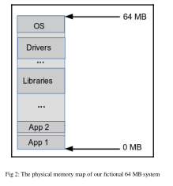

# VM's Objective



- The following C program intends to copy some memory, 1024 bytes, using the usual `memcpy(3)` glibc API, from a source location 300 KB into the program to a destination location 400 KB into the program.
- As Application 1 is the program at the low end of physical memory, it starts at the 0x0 physical offset.

```css
phy_offset = 0x0;
src = phy_offset + (300 * 1024); // = 0x0004 b000
dest = phy_offset + (400 * 1024); // = 0x0006 4000
n = 1024;
memcpy(dest, src, n);
```

.png)

- This works, all remains the same, except this time, due to a bug, the `dest` pointer is modified as follows:

```css
phy_offset = 0x0;
src = phy_offset + (300 * 1024); // = 0x0004 b000
dest = phy_offset + (400 * 1024* 156); // = 0x03cf 000 /BUG!
n = 1024;
memcpy(dest, src, n);
```

- The destination location is now around 64KB(0x03cf0000 - 0x03d00000) into the OS.
- The code itself does not fail. `memcpy()` does its job.
- Now the OS is probably corrupted and the entire system will eventually crash.
- In spite of this bug, memcpy succeeds because we are programming in C - we are free to read and write physical memory as we wish.
- This is one of the key reasons why VM systems came into existence.