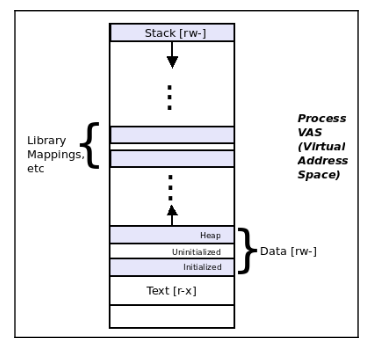

# The exec Unix axiom

- A process can be visualized as a box (a rectangle), having a **virtual address space (VAS)**.
- The VAS consists of homogeneous regions (technically, mappings) called segments.
- A process's VAS is thus made up of several segments - text (code), data segments, library (and other) mappings, and a stack.

 

- The lower end has a virtual address of 0, and addresses increase as we go up; we have an upward-growing heap and a downward-growing stack.
- Every process alive on the machine will have just such a process VAS. 
- Let's say the shell process bash has a PID of 3396. When we run `ps` from the shell, what actually happens?
  - The shell checks whether `ps` is a built-in command. If so it runs it. If not, it continues on to the second step.
  - Now, the shell parses the `PATH` environment variable, and say, locates `ps` in `/bin`.
  - The third step, is where the shell process now executes `/bin/ps` via an API.
- The `exec` when it occurs, causes the calling process (bash) to execute the called **process (ps)** by having (among other setups), `ps` overwrite its **Virtual Address Space (VAS)**.
- The process execution on Unix, and thus Linux is effected by having one process - the **caller** - get overwritten by the process to execute - the **callee**.


## Terminology

The process that is calling the `exec`  (`bash`, in our example) is called the *predecessor*.

The processs that gets called and executed (`ps` in our example) is called the *successor*.


## Key points during an `exec` operation

Important points to note when a predecessor process execs a successor:

- The successor process overwrites (or overlays) the predecessor's virtual address space.
  - In effect, the predecessor's text, data, library, and stack segments are now replaced by that of the successor's
  - The OS will take care of the size adjustments.
- No new process has been created. The successor now runs in the context of the old predecessor.
  - Several predecessor attributes (including but not limited to the PID and open files) thus get auto-inherited by the successor.
- On a successful `exec`, there is no possibility of returning to the predecessor, it's gone. After successful execution, the successor is all that's left.


## Experiment #1 

```sh
$ exec ps
```

- Here the terminal window process is the predecessor.
- Upon an `exec`, it is overwritten by the successor process `ps`, which does its work and exits.
- `ps` is the successor process, and we cannot return to the predecessor (the Terminal window). `ps` has literally replaced its VAS. 
- Thus, the Terminal window effectively disappears.


## Experiment #2

```sh
chan@CMA:~$ ps
    PID TTY          TIME CMD
  16386 pts/0    00:00:00 bash
  17347 pts/0    00:00:00 ps
chan@CMA:~$ bash
chan@CMA:~$ ps
    PID TTY          TIME CMD
  16386 pts/0    00:00:00 bash
  17348 pts/0    00:00:00 bash
  17364 pts/0    00:00:00 ps
chan@CMA:~$ exec ps
    PID TTY          TIME CMD
  16386 pts/0    00:00:00 bash
  17348 pts/0    00:00:00 ps
```

- We are spawning a subshell here, followed by `ps` once more.
- On the sub-shell, `exec` the `ps` command. This `ps` successor process overwrites (or overlays) the process image of the predecessor process - the bash sub-shell.


## The point of no return

- It's important for the systems programmer to understand that, once an `exec` operation is successful, there is no return to the predecessor process.

```c
int main(){
    foo()
        exec(something)
    bar()
}
```

- `main()` calls `foo()` which calls `exec(something)`. Once the `exec` is successful, `bar()` will never run!
- Because we cannot reach it in the predecessor's execution path as the entire execution context has now changed to the context of the successor process (something).
- The PID remains intact though.
- Only if the `exec` fails will the function `bar()` get control.