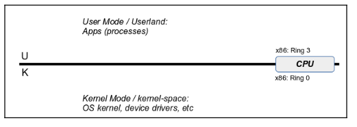

# CPU privilege levels

- Among the many fascinating registers on the x86_64 processor, there happen to be six control registers, named CR0 through CR4, and CR8. They are crucial to system control.
- CR0 contains system control flags that control operating mode and states of the procesor.
- If one has unlimited (read/write) access to the CR0 register, one could toggle bits that could do the following:
  - Turn hardware paging on or off
  - Disable the CPU cache
  - Change caching and alignment attributes
  - Disable WP (write protect) on memory (technically, pages) marked as read-only by the OS.
- A hacker could indeed wreak havoc. At the very least, only the OS should be allowed this kind of access.
- Precisely for reasons such as the security, robustness, and correctness of the OS and the hardware resources it controls, all modern CPUs include the notion of privilege levels.
  - Supervisor
  - User

| Privilege level or mode name | Privilege level | Purpose                    | Terminology             |
| ---------------------------- | --------------- | -------------------------- | ----------------------- |
| Supervisor                   | High            | OS code runs here          | kernel-space            |
| User                         | Low             | Application code runs here | user-space(or userland) |

- The processor ISA assigns every machine instruction with a privilege level or levels at which they are allowed to be executed.
- A machine instruction that is allowed to execute at the user privilege level automatically implies it can also be executed at the Supervisor privilege level.
- Any program which attempts to access the content of the CR0 control register, which is disallowed in User Mode (Ring 3), and allowed only at the Ring 0 privilege fails and crashes. Only OS or kernel code can access the control registers.