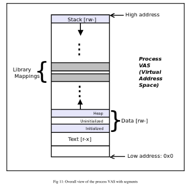

# Segments or mappings

- When a new process is created, its Virtual Address Space (VAS) must be set up by the OS.
- All modern OSes divide up the process VAS into homogeneous regions called **segments**.
- A **segment** is a homogeneous or uniform region of the process VAS.
  - It consists of virtual pages.
  - The segment has attributes, such as start and end addresses, protections (RWX/none), and mapping types. 

- All pages belonging to a segment share the same attributes.
- Technically, and more accurately from the OS viewpoint, the segment is called a **mapping**.

### Text segment

- Text is code: the actual opcodes and operands that make up the machine instructions that are fed to the CPU to consume.
- This machine code resides within the process VAS in a segment called **text**.
- Let's say a program has 32 KB of text; when we run it, it becomes a process and the text segment takes 32 KB of virtual memory; that's 32K/4K = 8 (virtual) pages.
- For optimization and protection, the OS protects all these eight pages of text as **read-execute(r-x)**. Code will be read from memory and executed by the CPU, not written to it.
- The text segment on Linux is always toward the low end of the process VAS.

### Data segments

- Immediately above the text segment is the data segment, which is the place where the process holds the program's global and static variables (data).
- It consists of the initialized data segment, the uninitialized data segment, and the heap segment.
- The text, initialized data, and uninitialized data segments are fixed in size; the heap is a dynamic segment - it can grow or shrink in size at runtime.

### Library segments

- When linking a program, we have two broad choices:
  - Static linking
  - Dynamic linking
- Static linking implies that any and all library text (code) and data is saved within the program's binary executable file (hence it's larger, and a bit faster to load up).
- Dynamic linking implies that any and all shared library text (code) and data is not saved within the program's binary executable file. Instead, it is shared by all processes and mapped into the process VAS at runtime (hence the binary executable is a lot smaller, though it might take a bit longer to load up).
  - Dynamic linking is always the default.
  - For example, we invoke `printf(3)`, but we did not write the code for it. We understand that it's within glibc and will be linked to our process at run time.
  - That's exactly what happens with dynamic linking: at process load, all the library text and data segments that the program uses are **memory-mapped** into the process VAS (in the region between the top of the heap and the bottom of the stack).

### Stack segment

- The CPU does not really understand how to invoke a C function, how to pass parameters, store local variables ,and return a result to the calling function.
- The compiler takes over, converting C code into an assembly language that is capable of making this whole function thing work.
- The compiler generates assembly code to invoke a function, passes along parameters, allocates space for local variables, and finally, emits a return result back to the caller.
- To do this, it uses the stack. So, similar to the heap, the stack is also a dynamic segment.
- Every time a function is called, memory is allocated in the stack region (or segment or mapping) to hold metadata that has the function call, parameter passing and the function return mechanism work.
  - This metadata region for each function is called the **stack frame**.
- Every function invocation is represented at runtime by a stack frame in the process's stack.
- If the processor is issued a push or pop instruction, it will go ahead and perform it.
- But how does the CPU know where exactly - at which stack memory location or address - it should push or pop memory?
- The answer is we reserve a special CPU register, the **stack pointer** (usually abbreviated to **SP**), for precisely this purpose: the value in SP always points to the top of the stack.
- The stack segment grows toward **lower virtual addresses**. This is often referred to as **stack-grows-down** semantics.
- The direction of stack growth is a CPU-specific feature dictated by the ABI for that CPU.
  - Most modern CPUs follow the stack-grows-down semantics.

**Process stack after `jail()`is called**

_iscalled.png)